# OOP-QL-PK – Quản lý phòng khám
- Tên dự án: Xây dựng hệ thống quản lý phòng khám
##  Triển Khai
- Tài Khoản: 23010139@st.phenikaa-uni.edu.vn
- Mật khẩu: nhom14
- Link Github Source Code: https://github.com/phamngocvu-pka/OOP_N03_25_26_VU_TUANANH_THIEN
- Link Youtube demo ứng dụng: 
- Link trang web chính thức: 
- Link trang web h2-console: h
## Cách chạy dự án
1. Clone Dự án 

   ```git clone https://github.com/phamngocvu-pka/OOP_N03_25_26_VU_TUANANH_THIEN ```

2.Run

   ```mvn spring-boot:run ```
#  MỤC LỤC

1. [Giới thiệu chung](#1-giới-thiệu-chung)  
   - [Thành viên dự án](#11-thành-viên-dự-án)  
   - [Yêu cầu chính](#12-yêu-cầu-chính)  
   - [Mô tả cụ thể](#13-mô-tả-cụ-thể)

2. [Object (Đối tượng chính)](#2-object-đối-tượng-chính)  
   - [Patient (Bệnh nhân)](#21-patient-bệnh-nhân)  
   - [Staff (Nhân viên)](#22-staff-nhân-viên)  
   - [Room (Phòng)](#23-room-phòng)  
   - [Department (Khoa)](#24-department-khoa)  
   - [Equipment (Thiết bị)](#25-equipment-thiết-bị)  
   - [Admission (Nhập viện)](#26-admission-nhập-viện)

3. [Sơ đồ hệ thống](#3-sơ-đồ-hệ-thống)  
   - [Sơ đồ khối tổng thể hệ thống](#31-sơ-đồ-khối-tổng-thể-hệ-thống)  
   - [Sơ đồ lớp / ERD](#32-sơ-đồ-lớp-class-diagram--erd)  
     - [Đăng nhập / Đăng xuất](#321-đăng-nhập--đăng-xuất-hệ-thống)  
     - [Luồng hoạt động người dùng](#322-toàn-bộ-luồng-hoạt-động-người-dùng-trong-hệ-thống)  
     - [CRUD Bệnh nhân](#323-crud-bệnh-nhân-patient)  
     - [CRUD Nhân viên](#324-crud-nhân-viên-staff)  
     - [CRUD Phòng bệnh](#325-crud-phòng-bệnh-room)  
     - [CRUD Khoa](#326-crud-khoa-department)  
     - [CRUD Thiết bị](#327-crud-thiết-bị-equipment)  
     - [Luồng nhập viện / xuất viện](#328-luồng-nhập-viện--xuất-viện-admission)

4. [Giao diện chính](#4-giao-diện-chính)  
   - [Đăng nhập](#41-đăng-nhập)  
   - [Trang chủ (Dashboard)](#42-trang-chủ-dashboard)  
   - [Quản lý bệnh nhân](#43-quản-lý-bệnh-nhân)  
   - [Quản lý nhân viên](#44-quản-lý-nhân-viên)  
   - [Quản lý phòng bệnh](#45-quản-lý-phòng-bệnh)  
   - [Quản lý khoa](#46-quản-lý-khoa)  
   - [Quản lý thiết bị y tế](#47-quản-lý-thiết-bị-y-tế)  
   - [Quản lý nhập viện / xuất viện](#48-quản-lý-nhập-viện--xuất-viện)  
   - [Đăng xuất](#49-đăng-xuất)

5. [Triển khai](#triển-khai)

---

## 1. Giới thiệu chung

### 1.1 Thành viên dự án
- Nguyễn Hoàng Thiên - 23010139
- Phạm Ngọc Vũ -23010192
- ...

### 1.2 Yêu cầu chính
- Xây dựng một hệ thống quản lý phòng khám theo kiến trúc **Spring Boot MVC**
- Hỗ trợ chức năng **CRUD đầy đủ** cho các thực thể: Bệnh nhân, Nhân viên, Phòng, Khoa, Thiết bị, Nhập viện
- Giao diện web dễ sử dụng (sử dụng Thymeleaf + Bootstrap)
- Xử lý lỗi toàn cục và kiểm thử nghiệp vụ
### 1.3 Mô tả cụ thể
####  Quản lý tài khoản
- Đăng nhập, đăng xuất hệ thống.
- Phân quyền người dùng theo vai trò (Admin, Bác sĩ, Y tá, Nhân viên lễ tân).

---

####  Quản lý bệnh nhân (Patient)
- Thêm, sửa, xóa hồ sơ bệnh nhân.
- Lưu trữ thông tin chi tiết: họ tên, ngày sinh, giới tính, địa chỉ, số điện thoại.
- Tìm kiếm bệnh nhân theo tên hoặc mã định danh.

---

####  Quản lý nhân viên (Staff)
- Quản lý danh sách nhân sự (bác sĩ, y tá, kỹ thuật viên…).
- Thêm mới, cập nhật, xóa thông tin nhân viên.

---

####  Quản lý phòng bệnh (Room)
- Quản lý danh sách phòng và giường bệnh.
- Thêm, sửa, xóa thông tin phòng (số phòng, tầng, loại phòng, sức chứa…).
- Theo dõi số lượng giường trống và giường đã sử dụng.
- Tự động cập nhật trạng thái phòng khi bệnh nhân nhập viện hoặc xuất viện.

---

####  Quản lý khoa (Department)
- Quản lý các khoa trong bệnh viện (nội, ngoại, sản, nhi...).
- Thêm, sửa, xóa thông tin khoa.

---

####  Quản lý thiết bị y tế (Equipment)
- Quản lý danh sách thiết bị y tế theo từng phòng hoặc khoa.
- Thêm, sửa, xóa thông tin thiết bị (tên, mã, trạng thái, mô tả).
- Theo dõi tình trạng sử dụng: đang hoạt động, bảo trì, hỏng.

---

####  Quản lý hồ sơ nhập viện (Admission)
- Ghi nhận thông tin nhập viện của bệnh nhân: phòng, thời gian vào viện, bác sĩ phụ trách.
- Cập nhật ngày xuất viện, tự động điều chỉnh số giường trống.
- Kết nối trực tiếp với module **Patient** và **Room** để đồng bộ dữ liệu.

---

## 2. Object (Đối tượng chính)

### 2.1 Patient (Bệnh nhân)
#### 2.1.1 Attribute (Thuộc tính)
- `id`: Long – mã định danh
- `fullName`: String – họ tên
- `dateOfBirth`: LocalDate – ngày sinh
- `gender`: String – giới tính
- `address`: String – địa chỉ
- `phone`: String – số điện thoại

#### 2.1.2 Methods (Phương thức)
- `getters / setters`
- `toString()`
- `equals()` / `hashCode()`

---

### 2.2 Staff (Nhân viên)
#### 2.2.1 Attribute
- `id`: Long
- `name`: String
- `role`: String (bác sĩ, y tá...)
- `phone`: String
- `email`: String

#### 2.2.2 Methods
- `getters / setters`
- `toString()`

---

### 2.3 Room (Phòng)
#### 2.3.1 Attribute
- `id`: Long
- `roomNumber`: String
- `capacity`: int – số giường
- `occupied`: int – số giường đã sử dụng
- `department`: Department – khoa liên kết

#### 2.3.2 Methods
- `assignPatient()`
- `releasePatient()`
- `getAvailableBeds()`

---

### 2.4 Department (Khoa)
#### 2.4.1 Attribute
- `id`: Long
- `name`: String
- `description`: String

#### 2.4.2 Methods
- `getters / setters`
- `toString()`

---

### 2.5 Equipment (Thiết bị)
#### 2.5.1 Attribute
- `id`: Long
- `name`: String
- `status`: String (còn sử dụng, đang sửa...)

#### 2.5.2 Methods
- `markAsInUse()`
- `markAsAvailable()`

---

### 2.6 Admission (Nhập viện)
#### 2.6.1 Attribute
- `id`: Long
- `patient`: Patient
- `room`: Room
- `admissionDate`: LocalDate
- `dischargeDate`: LocalDate (nullable)

#### 2.6.2 Methods
- `admitPatientToRoom()`
- `dischargePatient()`
- `calculateStayDuration()

## 3. Sơ đồ hệ thống
**Hình: Sơ đồ hoạt động project**
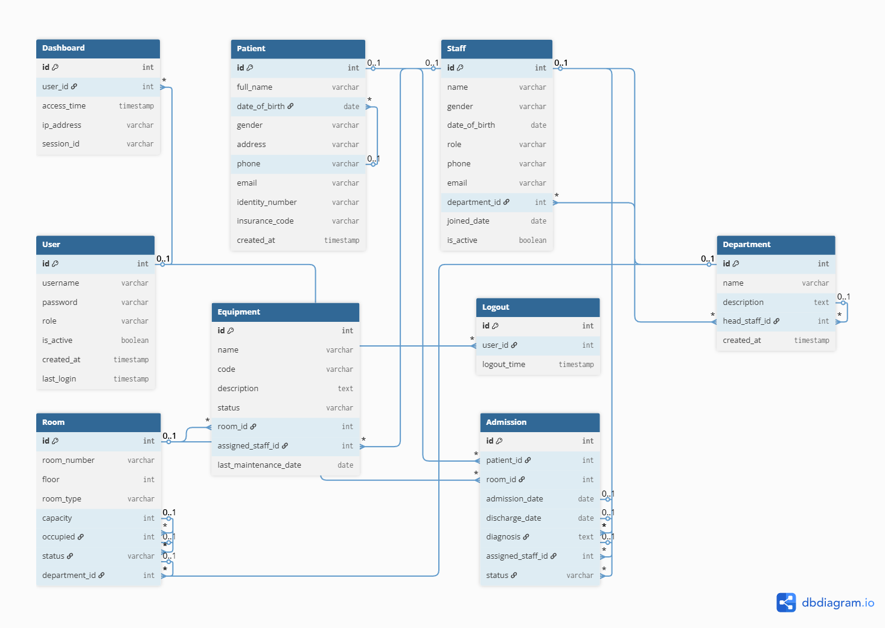
### 3.1 Sơ đồ khối tổng thể hệ thống

Hệ thống được tổ chức theo các nhóm chức năng chính:
- Hệ thống đăng nhập / phân quyền: Quản lý người dùng, session, đăng nhập, đăng xuất.
- Nghiệp vụ phòng khám: Quản lý bệnh nhân, nhân viên, khoa, phòng, thiết bị và hồ sơ nhập viện.
- Luồng xử lý chính: Từ đăng nhập → Dashboard → chọn chức năng CRUD các module → nhập viện → theo dõi → đăng xuất.

📷 **Hình: Sơ đồ khối tổng quan**  
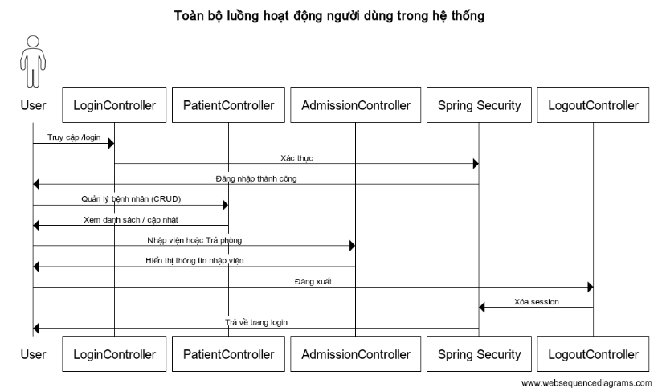

---

### 3.2 Sơ đồ lớp (Class Diagram / ERD)

#### 3.2.1 Đăng nhập / Đăng xuất hệ thống
- Mô tả quá trình xác thực người dùng với Spring Security khi truy cập vào hệ thống.
- Bao gồm các trường hợp:
  - Đăng nhập thành công → chuyển hướng về /home.
  - Đăng nhập thất bại → trả lỗi xác thực.
  - Đăng xuất → xóa session, chuyển về trang login.

📷 **Hình: Đăng nhập / Đăng xuất**  
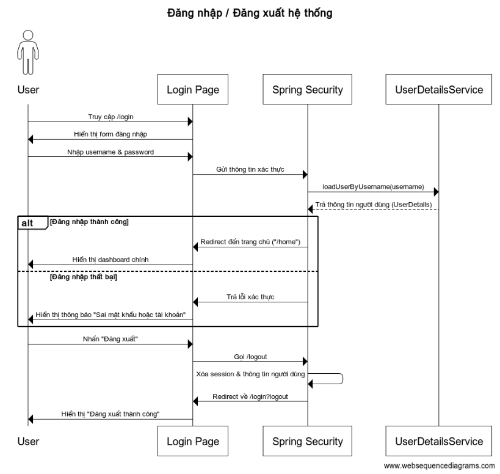

---

#### 3.2.2 Toàn bộ luồng hoạt động người dùng trong hệ thống
- Tổng quan hành vi người dùng từ lúc đăng nhập → thao tác CRUD bệnh nhân → nhập viện → đăng xuất.
- Mô hình hóa các controller chính: Login, Patient, Admission, Logout.

📷 **Hình: Toàn bộ luồng hoạt động**  


---

#### 3.2.3 CRUD Bệnh nhân (Patient)
- Thêm mới, xem danh sách, chỉnh sửa, xóa bệnh nhân.
- Tương tác giữa: `PatientController`, `PatientService`, `PatientRepo`, `DB`.

📷 **Hình: CRUD Bệnh nhân (Patient)**  
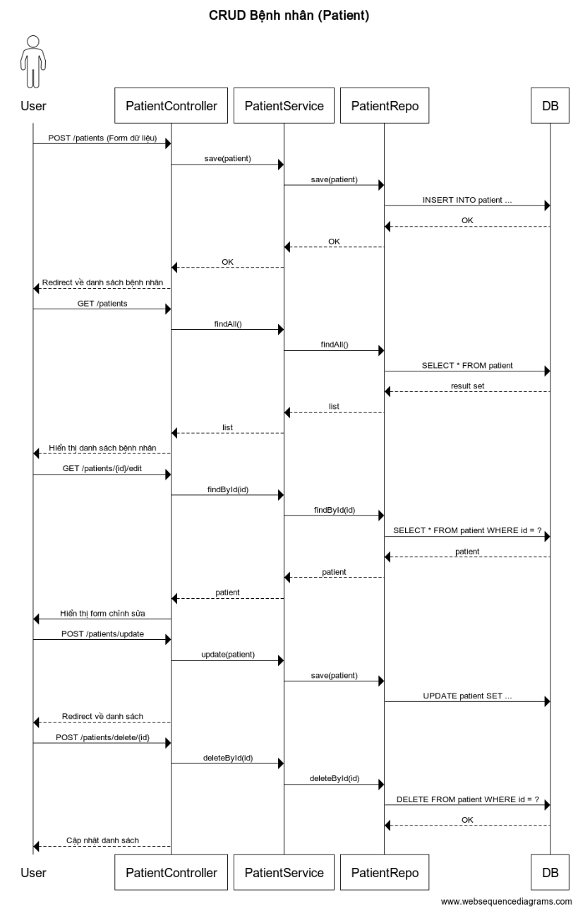

---

#### 3.2.4 CRUD Nhân viên (Staff)
- Quản lý nhân sự trong phòng khám.
- Bao gồm thêm mới, chỉnh sửa, xóa nhân viên.

📷 **Hình: CRUD Nhân viên (Staff)**  
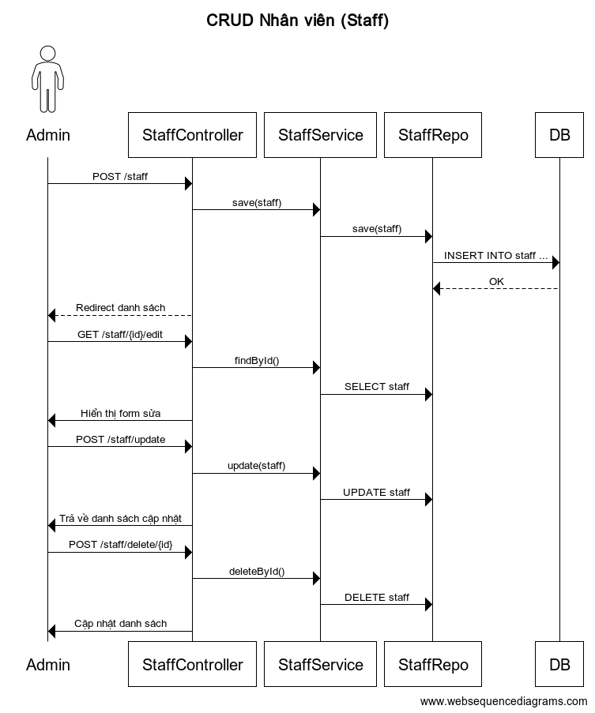

---

#### 3.2.5 CRUD Phòng bệnh (Room)
- Quản lý thông tin phòng bệnh, số lượng giường trống, loại phòng.
- Khi nhập viện hệ thống sẽ cập nhật trạng thái phòng.

📷 **Hình: CRUD Phòng bệnh (Room)**  
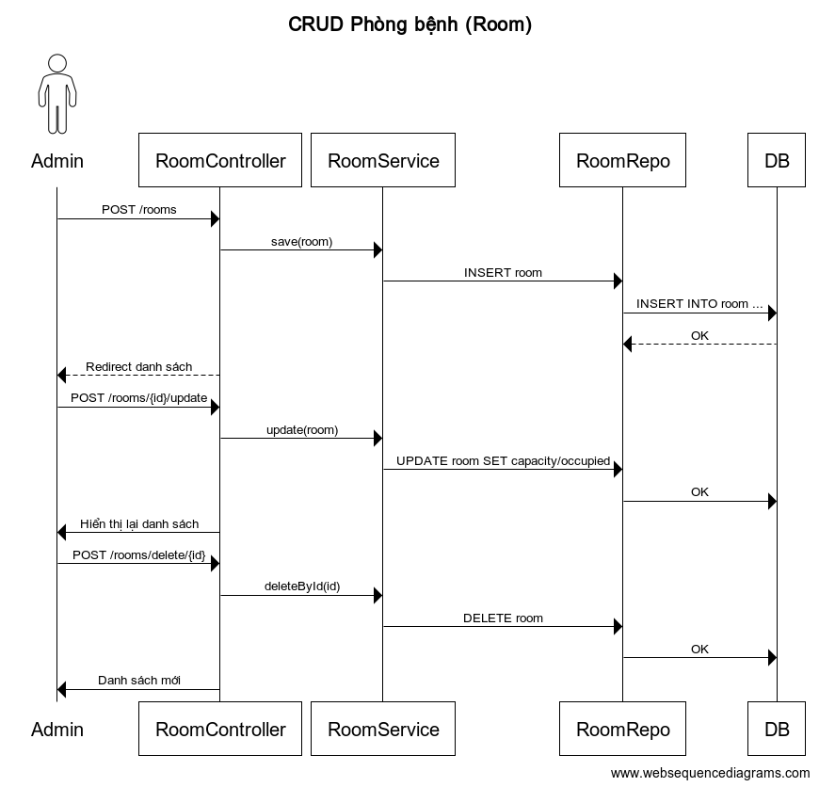

---

#### 3.2.6 CRUD Khoa (Department)
- Quản lý các khoa như nội trú, ngoại trú...
- Gắn trưởng khoa và danh sách phòng trực thuộc.

📷 **Hình: CRUD Khoa (Department)**  
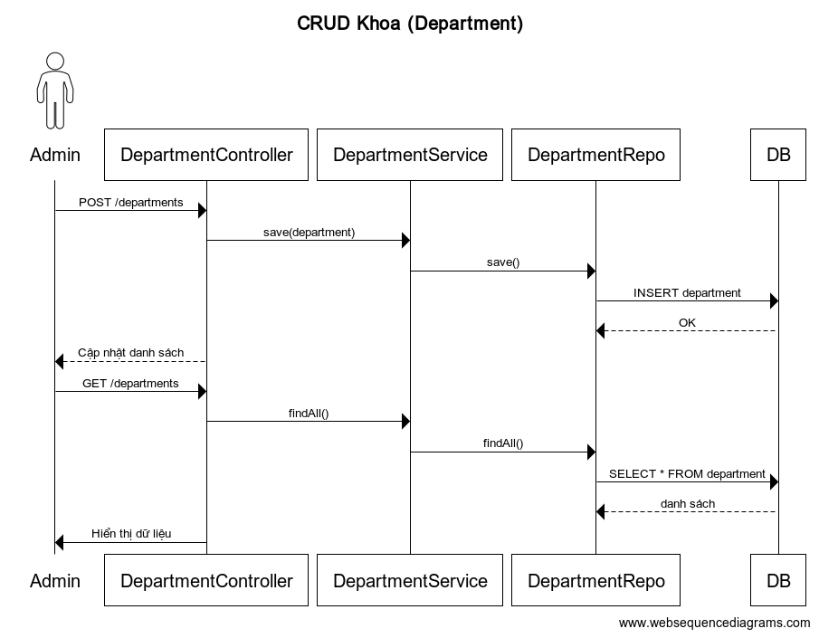

---

#### 3.2.7 CRUD Thiết bị (Equipment)
- Quản lý thiết bị trong từng phòng.
- Gắn trách nhiệm bảo trì cho từng nhân viên.

📷 **Hình: CRUD Thiết bị (Equipment)**  
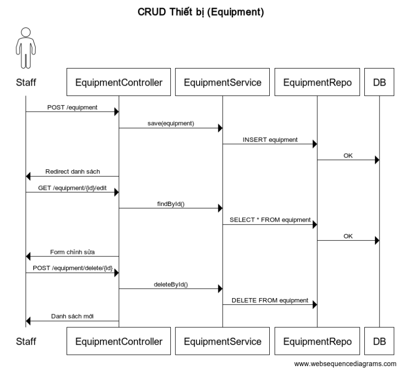

---

#### 3.2.8 Luồng nhập viện / xuất viện (Admission)
- Bệnh nhân được nhập viện (chọn phòng + ghi nhận thời gian).
- Khi xuất viện: cập nhật ngày ra và giảm số giường đã dùng.

📷 **Hình: Quy trình nhập viện / trả phòng**  
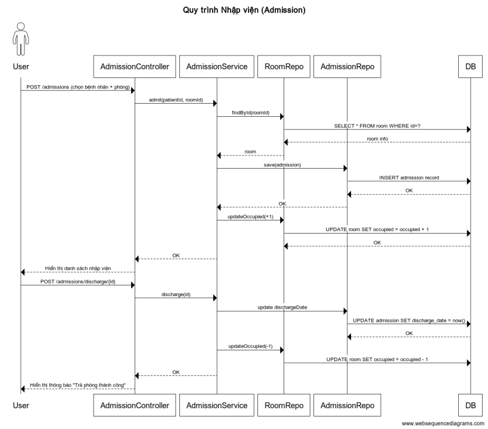

---

## 4. Giao diện chính

### 4.1 Đăng nhập
- Người dùng truy cập `/login` để nhập username và password.
- Sử dụng Spring Security để kiểm tra xác thực.
- Nếu sai sẽ hiện thông báo lỗi, nếu đúng chuyển đến trang chủ.
📷 **Hình: Giao diện đăng nhập**  
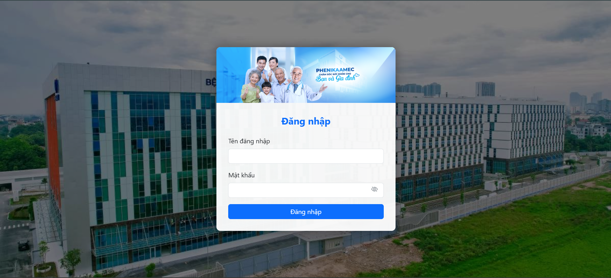

---

### 4.2 Trang chủ (Dashboard)
- Hiển thị tổng quan hệ thống: số lượng bệnh nhân, nhân viên, thiết bị, phòng đang hoạt động...
- Các nút truy cập nhanh đến các module như: Quản lý bệnh nhân, Phòng, Khoa, Thiết bị...

📷 **Hình: Giao diện trang chủ (Dashboard)**  
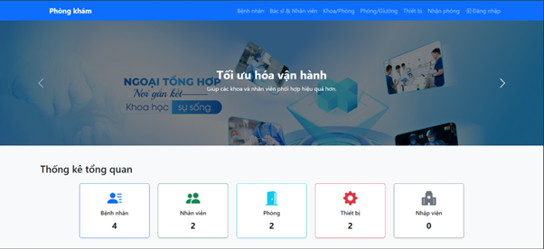
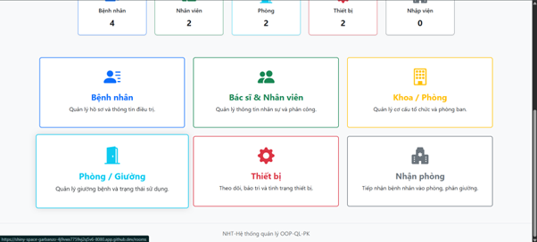

---

### 4.3 Quản lý bệnh nhân
- Danh sách bệnh nhân hiện tại.
- Chức năng: Thêm mới, sửa, xóa, tìm kiếm.
- Hiển thị các thông tin: tên, ngày sinh, giới tính, số điện thoại...

📷 **Hình: Giao diện quản lý bệnh nhân**  
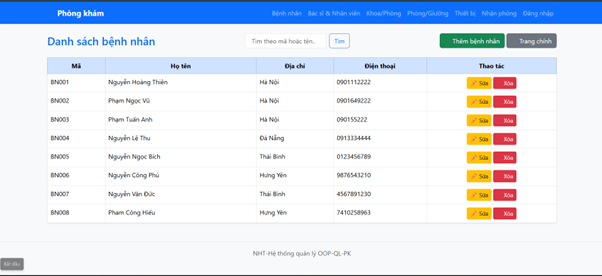

---

### 4.4 Quản lý nhân viên
- Danh sách nhân sự: bác sĩ, y tá, nhân viên hành chính...
- Có thể chỉnh sửa thông tin, phân công, xóa hoặc thêm mới.

📷 **Hình: Giao diện quản lý nhân viên**  
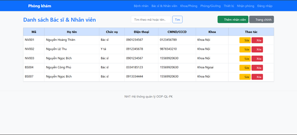

---

### 4.5 Quản lý phòng bệnh
- Xem danh sách các phòng theo từng tầng/khoa.
- Số lượng giường, trạng thái (đang sử dụng, còn trống).
- Cho phép thêm, cập nhật phòng.

📷 **Hình: Giao diện quản lý phòng bệnh**  
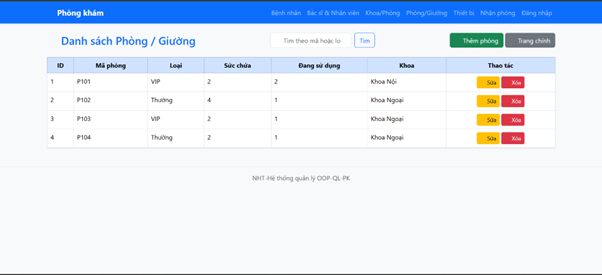

---

### 4.6 Quản lý khoa
- Danh sách các khoa: nội, ngoại, hồi sức, cấp cứu...
- Quản lý trưởng khoa, mô tả nhiệm vụ, danh sách phòng trong khoa đó.

📷 **Hình: Giao diện quản lý khoa**  


---

### 4.7 Quản lý thiết bị y tế
- Xem danh sách thiết bị: mã thiết bị, mô tả, trạng thái hoạt động.
- Giao diện dễ thao tác thêm/xóa/sửa nhanh thiết bị.
- Có phân công nhân viên bảo trì.

📷 **Hình: Giao diện quản lý thiết bị**  
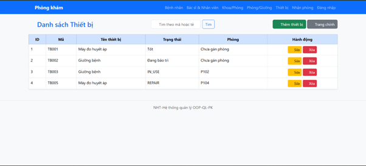

---

### 4.8 Quản lý nhập viện / xuất viện
- Giao diện chọn bệnh nhân, chọn phòng để nhập viện.
- Khi xuất viện chỉ cần bấm "Trả phòng", hệ thống cập nhật trạng thái phòng.

📷 **Hình: Giao diện nhập viện / xuất viện**  
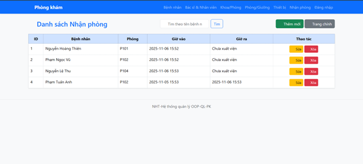

---

### 4.9 Đăng xuất
- Nút "Đăng xuất" luôn hiển thị trên thanh điều hướng.
- Khi click sẽ xóa session, chuyển về màn hình đăng nhập.

📷 **Hình: Giao diện khi đăng xuất thành công**  


---
