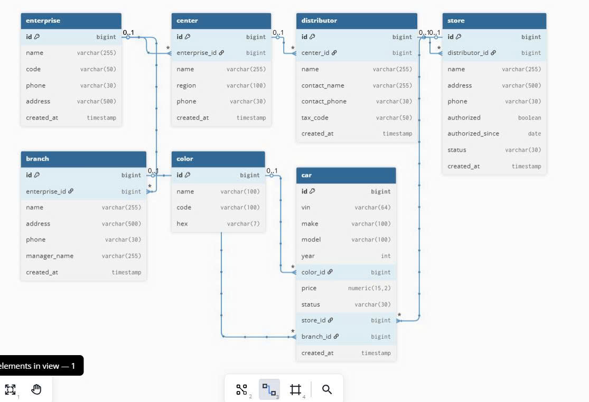

# OOP_Project

- Dự án OOP - Quản Lý Cửa Hàng Xe

# 1. Members (Thành viên dự án)
Phạm Ngọc Vũ - 23010192

Nguyễn Hoàng Thiên - 23010139

Phạm Tuấn Anh - 22010227
# 2. Yêu cầu chính

     Quản lý thông tin Các hãng xe

     Quản lý Màu Sắc

     Quản lý phòng ban & cơ sở vật chất.
     
     Quản lý Các chi nhánh.

# 3. Mô tả cụ thể

- Giới thiệu

    + Dự án này được xây dựng trong khuôn khổ môn học Lập trình Hướng đối tượng (OOP).
    + Mục tiêu là áp dụng các nguyên lý OOP (kế thừa, đóng gói, đa hình, trừu tượng) để xây dựng một hệ thống quản lý Cửa + + + Hàng Xe có khả năng quản lý thông tin Xe & Màu sắc, Chi nhánh, nhà phân phối.
- Mục tiêu

    + Rèn luyện kỹ năng thiết kế và lập trình theo hướng đối tượng bằng Java.
    + Mô phỏng hoạt động cơ bản của bệnh viện.
    + Xây dựng chương trình có tính mở rộng, dễ bảo trì và nâng cấp.
    + Ứng dụng các mô hình UML (Use Case, Class Diagram, Sequence Diagram) vào phân   tích và thiết kế hệ thống.

- Công nghệ sử dụng

   + Ngôn ngữ: Java
   + IDE: IntelliJ IDEA / NetBeans / Eclipse
   +Quản lý mã nguồn: GitHub
   + Mô hình thiết kế: UML

- Chức năng chính

    + Quản lý bệnh nhân
    + Thêm, sửa, xóa, tìm kiếm thông tin bệnh nhân.
    + Lưu trữ thông tin hồ sơ bệnh án.
    + Quản lý bác sĩ & nhân viên
    + Quản lý danh sách bác sĩ, y tá, nhân viên.
    + Phân công lịch làm việc.
    + Quản lý phòng ban & cơ sở vật chất
    + Quản lý khoa phòng, giường bệnh, phòng khám.
    + Theo dõi tình trạng sử dụng.
    + Quản lý lịch hẹn & khám chữa bệnh
    + Đặt lịch hẹn cho bệnh nhân.
    + Ghi nhận chẩn đoán và toa thuốc.
    + Quản lý thanh toán
    + Quản lý hóa đơn viện phí.
    + Thống kê và báo cáo chi phí.

# 4. Objects (Đối tượng)

## 4.1 Car (Xe)

### 4.1.1. Attribute (Thuộc tính)

```
    String id;
    String name;
    String brand;
    MauSac color;
    long price;
    String image;
 ```

### 4.1.2. Methods (Phương thức)

```
 Person().
 set(), get() cho từng thuộc tính.
 String getId().
 String getName().
 String getBrand().
 MauSac getColor().
 long getPrice().
 String getImage().
 ```

## 4.2. User (Người dùng)

### 4.2.1. Attribute (Thuộc tính)

```
 String username (tài khoản)
 String password (mật khẩu)
 String role (chức vụ)
 ```

### 4.2.2. Methods (Phương thức)

```
 User().
 set(), get() cho từng thuộc tính.
 login().
 logout().
 changePassword().
 resetPassword().
 ```

## 4.3. Nhà Phân Phối (cửa hàng)

### 4.3.1. Attribute (Thuộc tính)

```
   String doanhNghiep; 
   String quocGia;  
   String khuVuc;    
   String tenCuaHang;   
   String diaChi; 
 ```

### 4.3.2. Methods (Phương thức)

```
 String getDoanhNghiep().
 String getQuocGia().
 String getKhuVuc().
 String getTenCuaHang().
 String getDiaChi().

 ```

## 4.4. ShopCarTree (Cây Cửa Hàng Xe)

### 4.4.1. Attribute (Thuộc tính)

 ```
Person root ()
List <Person> members ()
 ```

### 4.4.2. Methods (Phương thức)

 ```
ShopCarTree().
addNode().
display().
 ```


# 5 Sơ đồ khối

## 5.1 UML Class Diagram


=======

>>>>>>> 
